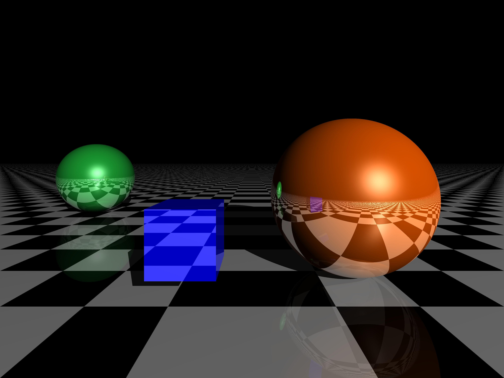

<div>
<div style="width:52px;float:left; font-family:方正公文黑体;">目的：</div> 
<div style="overflow:hidden; font-family:华文楷体;">本实验旨在探究光线跟踪方法在计算机图形学中的应用，通过使用Python来实现基本的光线追踪算法。通过该实验，我们将了解基本的光线跟踪计算原理，以及如何在Python环境中实现它们。
</div>
<div>
<div style="width:52px;float:left; font-family:方正公文黑体;">环境：</div> 
<div style="overflow:hidden; font-family:华文楷体;">Python、Numpy、Matplotlib </div>
</div>


<hr>													
<center><b><font size=6>实验报告正文</font></b></center>


# 实验过程

## 基础物体设置

用字典设置了基础物体的类型、位置、颜色等基础属性。

### plane

```python
import numpy as np

def plane(
        position, 
        normal, 
        color=np.array([1., 1., 1.]), 
        reflection=0.15,
        diffuse=0.75,
        specular_c=0.3,
        specular_k=50,
        ):
    return dict(
        type='plane',
        position=np.array(position),
        normal=np.array(normal),
        # 默认为棋盘格
        color=lambda P: (np.array([1.,1.,1.]) if (int(P[0]*2)%2) == (int(P[2]*2)%2) else (np.array([0.,0.,0.]))),
        reflection=reflection, 
        diffuse=diffuse, 
        specular_c=specular_c, 
        specular_k=specular_k
    )
```

### cube

```python
import numpy as np

def cube(
        position,
        length,
        color,
        reflection=0.6,
        diffuse=1,
        specular_c=0.6,
        specular_k=50,
):
    
    return dict(
        type='cube',
        position=np.array(position),
        length=np.array(length),
        color=np.array(color),
        reflection=reflection,
        diffuse=diffuse,
        specular_c=specular_c,
        specular_k=specular_k
    )
```

### sphere

```python
import numpy as np
def sphere(
        position,
        radius,
        color,
        reflection=0.85,
        diffuse=1,
        specular_c=0.6,
        specular_k=50,
):
    return dict(
        type='sphere',
        position=np.array(position),
        radius=np.array(radius),
        color=np.array(color),
        reflection=reflection,
        diffuse=diffuse,
        specular_c=specular_c,
        specular_k=specular_k
    )
```

## 光线追踪

### 基本运算函数

定义了归一化和获取不同物体的法向量的函数。

```python
import numpy as np

def normalize(x):
    x /= np.linalg.norm(x)
    return x

def get_normal(obj, M):
    # coordination def: [0] is x, - left, + right [1] is y - down + up
    # obj: object
    # M: point on the surface of obj
    if obj['type'] == 'sphere':
        N = normalize(M - obj['position'])
    elif obj['type'] == 'plane':
        N = obj['normal']
    elif obj['type'] == 'cube':
        # up coordinate: 0, 1, 0
        # down coordinate: 0, -1, 0
        # left coordinate: -1, 0, 0
        # right coordinate: 1, 0, 0
        # front coordinate: 0, 0, -1
        # back coordinate: 0, 0, 1
        P = obj['position']
        L = obj['length']
        
        if abs(M[1] - P[1] - L/2) < 1e-9:
            return np.array([0, 1, 0])
        if abs(M[0] - P[0] - L/2) < 1e-9:
            return np.array([1, 0, 0])
        if abs(P[0] - M[0] - L/2) < 1e-9:
            return np.array([-1, 0, 0])
        if abs(P[1] - M[1] - L/2) < 1e-9:
            return np.array([0, -1, 0])
        if abs(P[2] - M[2] - L/2) < 1e-9:
            return np.array([0, 0, -1])
        if abs(M[2] - P[2] - L/2) < 1e-9:
            return np.array([0, 0, 1])
        N = np.zeros(3)

    return N
```

### 光线到物体表面的距离

- **平面判断**：平面的法线方向通过点积计算得到，检测是否平行于光线。
- **球体判断**：通过检测球心到光线的投影是否在球内，以及光线是否朝向球体的方向来判断相交。
- **立方体判断**：对每个面（看作有定义域限制的平面）进行判断，检查光线是否与平面相交。

```python
def intersect_plane(O, D, P, N):
    # O: ray origin
    # D: ray direction
    # P: any point on the plane
    # N: normal of the plane
    # return: distance from O to the intersection point
    denom = np.dot(D, N)
    if np.abs(denom) < 1e-9:
        return np.inf  # parallel to the plane
    d = np.dot(P - O, N) / denom
    if d < 0:
        return np.inf
    return d

def intersect_sphere(O, D, C, R):
    # O: ray origin
    # D: ray direction
    # C: center of the sphere
    # R: radius of the sphere
    # return: distance from O to the intersection point
    a = np.dot(D, D)
    OC = C - O
    if (np.linalg.norm(OC) < R) or (np.dot(OC, D) < 0):
        return np.inf
    l = np.linalg.norm(np.dot(OC, D))
    m = np.linalg.norm(OC) * np.linalg.norm(OC) - l * l
    q = R * R - m

    return (l - np.sqrt(q)) if q >= 0 else np.inf

def intersect_cube(O, D, P, L):
    # O: ray origin
    # D: ray direction
    # P: position of the cube
    # L: length of the cube
    # return: distance from O to the intersection point
    assert(abs(np.linalg.norm(D) - 1) < 1e-9)
    t = np.inf
    # intersect with z=P[2] - L/2 and z=P[2] + L/2
    if abs(D[2]) < 1e-9:
        pass # parallel to the plane
    else:
        rate = (P[2] - L/2 - O[2]) / D[2]
        if rate > 0:
            intersect_point = O + rate * D
            if abs(intersect_point[0] - P[0]) < L/2 and abs(intersect_point[1] - P[1]) < L/2:
                t = rate
        rate = (P[2] + L/2 - O[2]) / D[2]
        if rate > 0:
            intersect_point = O + rate * D
            if abs(intersect_point[0] - P[0]) < L/2 and abs(intersect_point[1] - P[1]) < L/2:
                t = min(t, rate)
    # intersect with y=P[1] - L/2 and y=P[1] + L/2
    if abs(D[1]) < 1e-9:
        pass
    else:
        rate = (P[1] - L/2 - O[1]) / D[1]
        if rate > 0:
            intersect_point = O + rate * D
            if abs(intersect_point[0] - P[0]) < L/2 and abs(intersect_point[2] - P[2]) < L/2:
                t = min(t, rate)
        rate = (P[1] + L/2 - O[1]) / D[1]
        if rate > 0:
            intersect_point = O + rate * D
            if abs(intersect_point[0] - P[0]) < L/2 and abs(intersect_point[2] - P[2]) < L/2:
                t = min(t, rate)
    # intersect with x=P[0] - L/2 and x=P[0] + L/2
    if abs(D[0]) < 1e-9:
        pass
    else:
        rate = (P[0] - L/2 - O[0]) / D[0]
        if rate > 0:
            intersect_point = O + rate * D
            if abs(intersect_point[1] - P[1]) < L/2 and abs(intersect_point[2] - P[2]) < L/2:
                t = min(t, rate)
        rate = (P[0] + L/2 - O[0]) / D[0]
        if rate > 0:
            intersect_point = O + rate * D
            if abs(intersect_point[1] - P[1]) < L/2 and abs(intersect_point[2] - P[2]) < L/2:
                t = min(t, rate)
    return t
```

### 获取对应像素值

```python
def intersect_color(O, D, I, scene, light_point, light_color, ambient):
    # O: ray origin
    # D: ray direction
    # I: intensity
    # return: color of the intersection point

    min_dist = np.inf
    for i, obj in enumerate(scene):
        cur_dist = intersect(O, D, obj)
        if cur_dist < min_dist:
            min_dist = cur_dist
            obj_idx = i
    # print(min_dist)
    # exit()
    if min_dist == np.inf or I < 0.01:
        return np.zeros(3)
    
    obj = scene[obj_idx]
    P = O + min_dist * D  # intersection
    
    color = get_color(obj, P)
    N = get_normal(obj, P)
    toL = normalize(light_point - P)
    toO = normalize(O - P)

    c = ambient * color

    l = [intersect(P + N * .0001, toL, obj_sh) for k, obj_sh in enumerate(scene) if k != obj_idx]

    if not (l and min(l) < np.linalg.norm(light_point - P)):
        c += color * obj['diffuse'] * max(np.dot(N, toL), 0) * light_color
        c += obj['specular_c'] * max(np.dot(N, normalize(toL + toO)), 0) ** obj['specular_k'] * light_color

    reflect_ray = D - 2 * np.dot(D, N) * N
    c += obj['reflection'] * intersect_color(P + N * .0001, reflect_ray, I * obj['reflection'], scene, light_point, light_color, ambient)
    
    return np.clip(c, 0, 1)
```

其中部分代码必要的说明如下。

#### 漫反射（diffuse）

$$
c_{diffuse} = c_{light}k_{diffuse}c_{object}\max(\vec{n}\cdot \vec{l}, 0)
$$

```python
c += color * obj['diffuse'] * max(np.dot(N, toL), 0) * light_color
```


#### 阴影（shadow）

从目标点向光源发射一条射线，检测是否与其他物体相交

```python
c = ambient * color

l = [intersect(P + N * .0001, toL, obj_sh) for k, obj_sh in enumerate(scene) if k != obj_idx]

if not (l and min(l) < np.linalg.norm(light_point - P)):
    c += color * obj['diffuse'] * max(np.dot(N, toL), 0) * light_color
```

#### 高光

根据Blinn-Phong 模型

```python
c = ambient * color

l = [intersect(P + N * .0001, toL, obj_sh) for k, obj_sh in enumerate(scene) if k != obj_idx]

if not (l and min(l) < np.linalg.norm(light_point - P)):
	c += color * obj['diffuse'] * max(np.dot(N, toL), 0) * light_color
	c += obj['specular_c'] * max(np.dot(N, normalize(toL + toO)), 0) ** obj['specular_k'] * light_color
```

#### 反射

每次反射，我们都将光线强度乘以反射系数（表征反射光线的衰减），并在函数开始时判断当光线强度弱于 0.01 时结束递归。

```python
reflect_ray = D - 2 * np.dot(D, N) * N
    c += obj['reflection'] * intersect_color(P + N * .0001, reflect_ray, I * obj['reflection'], scene, light_point, light_color, ambient)
```


# 实验结果

## 不同视点结果




# 实验总结

本实验深入了解了光线跟踪方法在计算机图形学中的基本原理，并成功在Python环境中实现。通过实验，我加深了对光照模型、材质属性等概念的理解，并学会了如何使用光线跟踪方法创建逼真的图像。这些方法在计算机图形学、电影制作等领域有着广泛的应用，为我们理解计算机图形学提供了深刻的见解。
